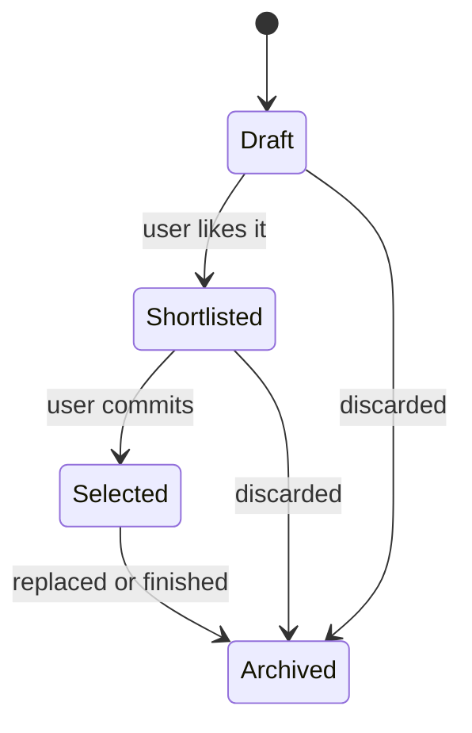
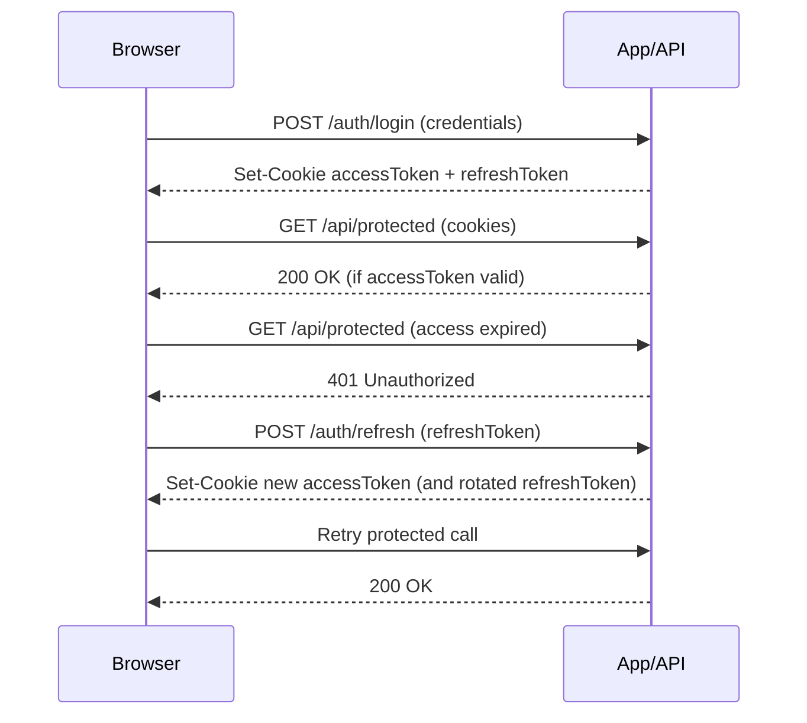

# Neuraal — Design Document

**Project:** Neuraal (Web App — Master’s Final Project)  
**Document type:** Software Design Document (SDD)  
**Status:** Draft (living document)  
**Last updated:** 2026-01-28

---

## 1. Overview

Neuraal is a responsive web application built with **Next.js** aimed at helping users explore, organize and refine **topics** using an interactive UI composed of *topics* and a *calendar-like* view.

This document describes the system’s goals, architecture, key modules, domain model, security approach, testing strategy, and operational concerns. It is intended to live inside `docs/` and evolve alongside the codebase.

---

## 2. Goals & Non‑Goals

### 2.1 Goals
- Provide a **responsive** UI that works well on desktop and mobile.
- Make the topic exploration experience **fast, fluid, and visually clear** (low cognitive load).
- Use **feature-based modularization** (e.g., `topics`, `calendar`) with strict boundaries.
- Enable long-term maintainability via **Clean Architecture-inspired layering** and explicit dependency direction.
- Support **robust testing** (unit + integration + E2E) and CI-friendly execution.
- Bake in security best practices for authentication/authorization and general web risk mitigation.

### 2.2 Non‑Goals (for the initial scope)
- Full social features (sharing, collaboration) unless explicitly added later.
- Complex analytics pipeline beyond basic observability (Sentry + basic metrics).
- Building a generalized “platform”; prioritize the product flow first.

---

## 3. Stakeholders & Users

### 3.1 Primary user
- A single end-user exploring, selecting, and planning work on topics (TFM context).

### 3.2 Secondary stakeholders
- Maintainers (you / future contributors).
- Reviewers/evaluators of the TFM.

---

## 4. Product Requirements (Functional)

> Note: This section is intentionally concise and should mirror the canonical requirements in `README.md`.

### 4.1 Topics (feature)
- Create / view / update / delete topics.
- Display topics in a “bubble-like” UI (topic bubbles and anchors).
- Support positioning (layout coordinates / junctions) and UI state transitions.

### 4.2 Calendar (feature)
- Provide a calendar-like visualization for days/months.
- Derive display values when possible (avoid storing duplicated “derivable” fields).

### 4.3 Authentication (planned / optional depending on scope)
- Support a standard login flow with token-based authentication.
- Use secure token storage patterns (avoid localStorage/sessionStorage for auth tokens).

---

## 5. Architecture

### 5.1 High-level view

Neuraal uses a Clean Architecture-inspired separation of concerns:

- **Domain**: Entities / Value Objects / Domain rules (pure TypeScript)
- **Application**: Use cases, DTOs, ports (interfaces)
- **Infrastructure**: Framework adapters (Next.js APIs, persistence, external services)
- **UI / Presentation**: Next.js pages/routes, feature UI components, view models

### 5.2 Dependency direction

Allowed dependencies:

- `domain` ← (no deps on app/infra/ui)
- `application` → `domain`
- `infrastructure` → `application` and `domain`
- `ui` (features/components) → `application` and `domain` (never infrastructure directly)

Rule of thumb: **outer layers depend on inner layers; never the reverse**.

### 5.3 Repository structure (target)

A practical “feature-first + layers” layout:

```
src/
  app/                       # Next.js App Router entrypoints (routes, layouts)
  features/
    topics/
      components/
      hooks/
      types.ts               # UI types for topics
      ...
    calendar/
      components/
      hooks/
      types.ts               # UI types for calendar
      ...
  shared/
    types/                   # Domain types only (no UI state)
    utils/
  domain/
    entities/
    value-objects/
    services/
  application/
    use-cases/
    ports/
    dto/
  infrastructure/
    auth/
    persistence/
    monitoring/
    config/
docs/
  design.md                  # this document
  adr/                       # Architecture Decision Records (see §12)
```

> The actual folder names should match your existing code conventions, but the core idea is: features own feature UI types and state, `shared/` stays domain-centric.

---

## 6. Domain Model (Conceptual)

### 6.1 Core concepts

#### Topic
Represents a candidate theme/idea the user can work on.

Typical attributes (conceptual):
- `id`
- `title`
- `description`
- `status` (e.g., draft/shortlist/selected)
- `tags` (optional)
- `createdAt`, `updatedAt`

#### Topic UI Concepts
These are presentation-layer concepts and should live in `src/features/topics/types.ts`:
- `TopicAnchor`
- `TopicPosition`
- `TopicBubbleState`
- `JunctionPosition`
- `DefaultTopicConfig`

#### Calendar UI Concepts
These are presentation-layer concepts and should live in `src/features/calendar/types.ts`:
- `CalendarViewState`
- `CalendarDayUI`
- `CalendarMonthUI`
- `TopicBubbleUI`

### 6.2 Example: Topic lifecycle (simplified state machine)



---

## 7. Key Flows

### 7.1 Topic exploration flow (UI)
1. User opens the app.
2. Sees topic bubbles/anchors.
3. Adds/edits topics and visually organizes them.
4. Marks candidates as shortlisted/selected.

### 7.2 Calendar planning flow (UI)
1. User navigates month/week/day views.
2. Calendar derives day labels and view data from a single source of truth (`date`).
3. Topics may be displayed within or alongside calendar context.

### 7.3 Authentication flow (if enabled)
A secure two-token strategy:
- **Access token** (short life, e.g., 15 min)
- **Refresh token** (longer life, e.g., 7 days)
- Tokens stored as **httpOnly cookies**; refresh endpoint rotates tokens.



---

## 8. API & Data (Proposed)

> This section may be adapted based on whether you use Next.js Route Handlers, a separate backend, or both.

### 8.1 Suggested API endpoints
- `POST /api/auth/login`
- `POST /api/auth/refresh`
- `POST /api/auth/logout`
- `GET /api/topics`
- `POST /api/topics`
- `PATCH /api/topics/:id`
- `DELETE /api/topics/:id`

### 8.2 Persistence (TBD)
Decide one of:
- Local-first (IndexedDB/local persistence) for early iteration.
- Server-backed (Postgres) with an ORM (e.g., Prisma).
- Hybrid.

**Open question:** What persistence strategy do you want for v1?

---

## 9. Security

### 9.1 Token storage
- Do **not** store auth tokens in `localStorage` or `sessionStorage`.
- Use **httpOnly cookies** with:
  - `httpOnly: true`
  - `secure: true` (in production)
  - `sameSite: 'lax'` or `'strict'` depending on flows

### 9.2 AuthZ
- Authorization must be enforced on the server for every protected action.
- Use `401` for unauthenticated and `403` for insufficient permissions.

### 9.3 OWASP-driven controls (baseline)
- Broken access control: server-side permission checks for every request.
- Cryptographic failures: secrets in env vars; no hardcoding; enforce HTTPS.
- Injection: parameterized queries if using SQL.
- Security misconfiguration: restrict CORS; no verbose stack traces in prod.
- Logging/monitoring failures: capture errors centrally (Sentry) and alert.

---

## 10. Testing Strategy

Adopt the testing pyramid:

- **Unit tests** (dominant): domain rules, pure functions, reducers/state logic
- **Integration tests**: feature components + state + providers
- **E2E tests**: critical user journeys (few, stable)

Suggested thresholds:
- Functions: 100%
- Lines/Branches/Statements: ~80% (focus on core logic, not type-only files)

Tools:
- Vitest + Testing Library
- Playwright for E2E

---

## 11. Observability & Performance

### 11.1 Error monitoring
Use Sentry for:
- Error tracking
- Performance monitoring
- Session replay (carefully, with privacy settings)

### 11.2 UX performance principles
- Keep interactions responsive (< 1s where possible).
- Prefer skeleton screens and optimistic UI for perceived performance.

---

## 12. Architecture Decision Records (ADRs)

Create short ADRs for major decisions (1 file per decision in `docs/adr/`).

Suggested initial ADRs:
- ADR-001: Next.js App Router + project structure
- ADR-002: State management approach (TBD)
- ADR-003: Testing stack (Vitest/Testing Library/Playwright)
- ADR-004: Auth strategy (JWT + httpOnly cookies + refresh rotation)
- ADR-005: Observability (Sentry)

---

## 13. Risks & Mitigations

- **Scope creep** → define v1 scope and defer extras to ADRs/backlog.
- **UI complexity** → keep UI state local to features; avoid shared global “god state”.
- **Security regressions** → keep auth storage safe; add headers and rate-limits early.
- **Performance drift** → set performance budgets + monitor with Sentry.

---

## 14. Open Questions (to resolve)

1. Persistence for v1: local-first vs DB-backed?
2. AI integration details (provider, prompting strategy, cost controls)?
3. Target auth provider: custom email/password vs OAuth?
4. Deployment target: Vercel vs self-hosted?
5. State management: Context + hooks vs Zustand vs other?

---

## 15. Glossary

- **AuthN**: Authentication — who the user can do.
- **AuthZ**: Authorization — what the user can do.
- **ADR**: Architecture Decision Record.
- **RUM**: Real User Monitoring.
