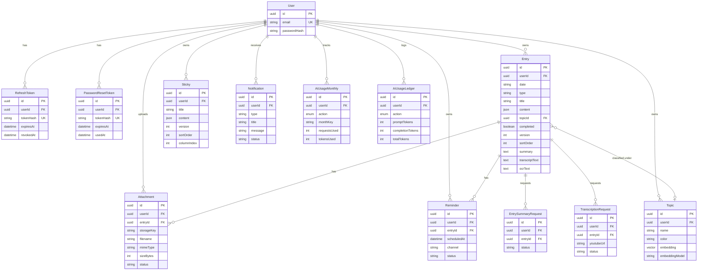
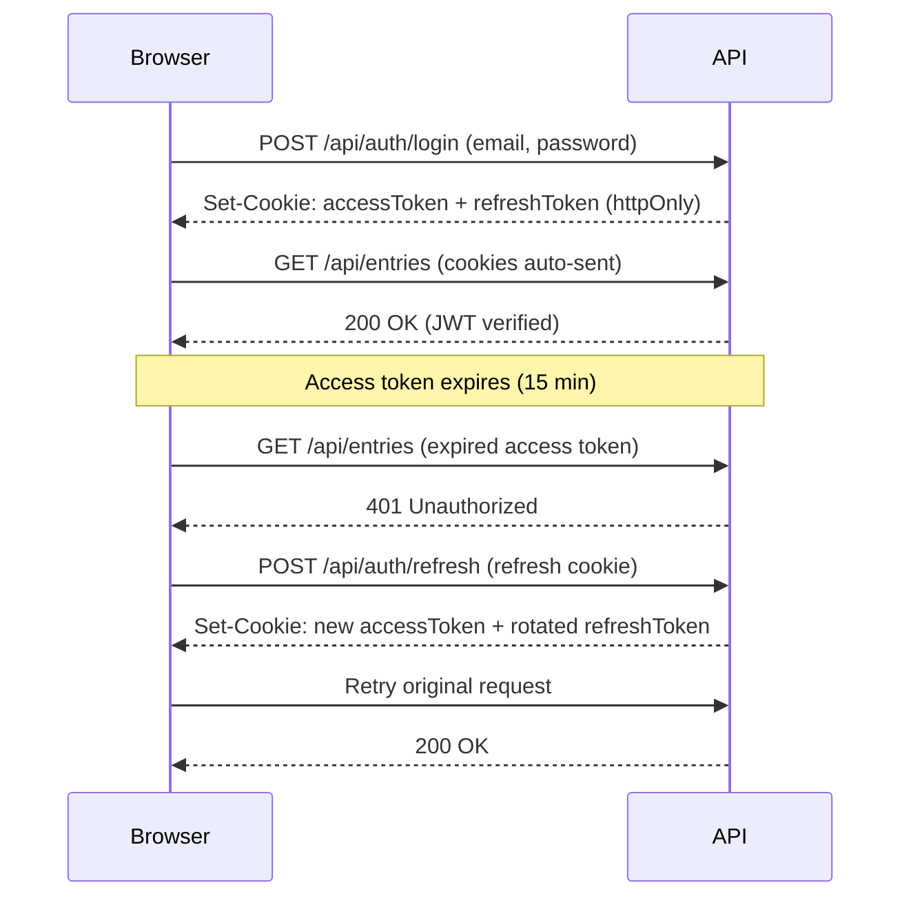
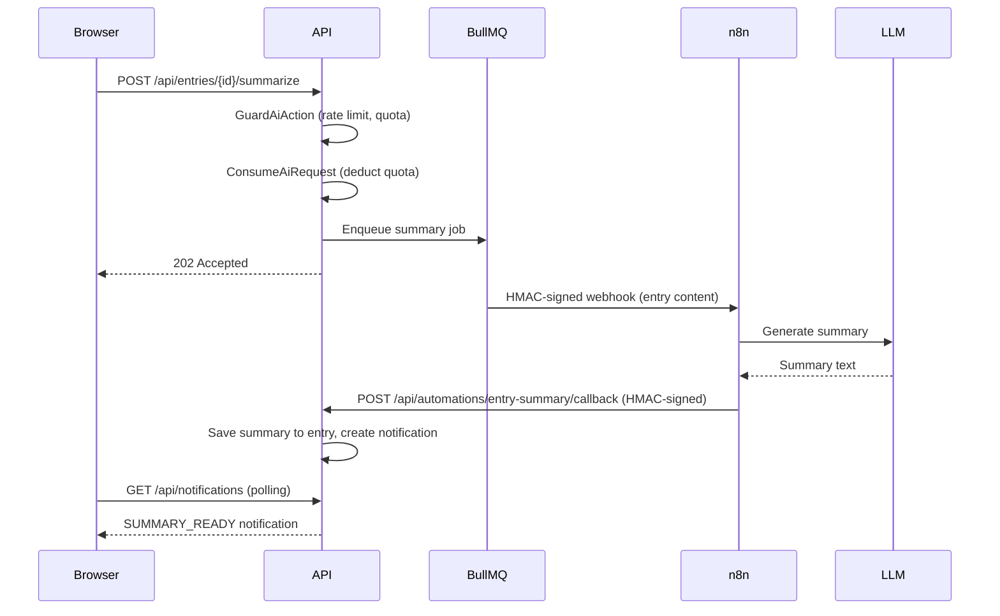
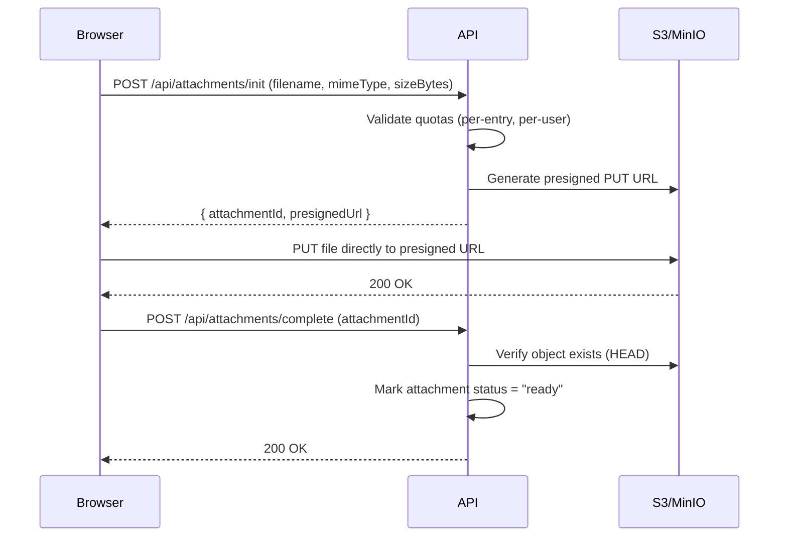
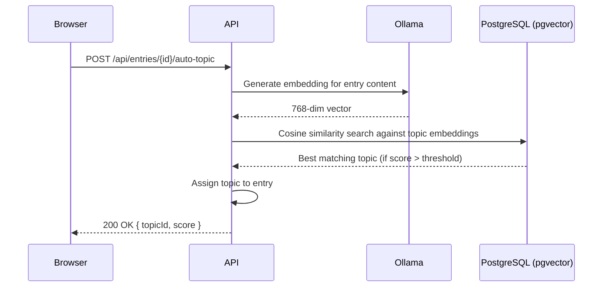
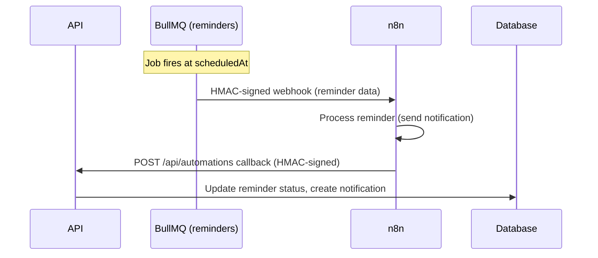

# Neuraal — Design Document

**Project:** Neuraal (Web App — Master's Final Project)  
**Document type:** Software Design Document (SDD)  
**Status:** Living document  
**Last updated:** 2026-02-18

---

## 1. Overview

Neuraal is a full-stack web application built with **Next.js 16** (App Router) that helps authenticated users manage **tasks**, **notes**, and **topics** through a calendar-driven dashboard. It features a rich text editor, file attachments, AI-powered summaries, auto-topic classification via embeddings, YouTube transcription, OCR, scheduled reminders, sticky notes, and weekly recap analytics.

This document describes the system's goals, architecture, domain model, key flows, security approach, testing strategy, and operational concerns. It lives inside `docs/` and evolves alongside the codebase.

---

## 2. Goals & Non-Goals

### 2.1 Goals

- Provide a **responsive** UI that works well on desktop and mobile.
- Make the productivity experience **fast, fluid, and visually clear** (low cognitive load).
- Use **feature-based modularization** with strict boundaries.
- Enable long-term maintainability via **Clean Architecture** layering and explicit dependency direction.
- Support **robust testing** (unit + integration + E2E) with risk-based coverage.
- Bake in **security best practices** (JWT auth, rate limiting, HMAC webhooks, security headers).
- Provide **AI-powered features** with responsible guardrails (quotas, rate limits, concurrency).
- Deploy via **Docker** with full **CI/CD pipeline** (GitHub Actions).

### 2.2 Non-Goals (for the initial scope)

- Full social features (sharing, collaboration) unless explicitly added later.
- Complex analytics pipeline beyond basic observability (Sentry + Prometheus metrics).
- Mobile native app (PWA may be explored post-launch).

---

## 3. Stakeholders & Users

### 3.1 Primary user

- An end-user managing tasks, notes, topics, and reminders through a calendar-driven productivity dashboard (TFM context).

### 3.2 Secondary stakeholders

- Maintainers (you / future contributors).
- Reviewers/evaluators of the TFM.

---

## 4. Product Requirements (Functional)

### 4.1 Authentication

- Register, login, logout, token refresh, password recovery, password reset, change password.
- JWT access + refresh tokens in httpOnly cookies with token rotation and reuse detection.
- Login rate limiting (5 failed attempts per IP triggers 5-minute lockout).
- Password policy: 8+ chars, uppercase, lowercase, digit, special character. Bcrypt (12 rounds).

### 4.2 Entries (Tasks & Notes)

- CRUD operations on entries (type: "task" or "note") bound to a calendar date.
- Rich text content stored as JSON (TipTap/ProseMirror document).
- Tasks have `completed` status; notes do not.
- Optimistic concurrency via `version` field (409 Conflict on stale updates).
- Drag-and-drop reorder within a day (`sortOrder`).
- Optional topic assignment (manual or AI auto-classification).

### 4.3 Topics

- Create / view / update / delete user-defined topics (color-coded categories).
- Display topics as floating interactive bubbles (D3 force layout).
- Embedding-based auto-topic: Ollama generates 768-dim vectors; cosine similarity via pgvector.
- Rebuild topic embedding on demand.

### 4.4 Reminders

- Schedule reminders for entries at a specific datetime.
- Channels: in-app notification, WhatsApp (deprecated, see ADR-013).
- Processed asynchronously via BullMQ worker + n8n workflow.
- Notification created on success or failure.

### 4.5 AI Features

- **Summaries**: Async via BullMQ -> n8n -> LLM -> callback. Returns markdown summary.
- **YouTube Transcription**: Async extraction from YouTube URLs embedded in entry content.
- **OCR**: Synchronous text extraction from images via Ollama vision model (`glm-ocr:q8_0`).
- **Auto-topic**: Embedding similarity matching (synchronous).
- All AI features protected by per-user guardrails (rate limits, concurrency, monthly quotas, input size).

### 4.6 Attachments

- Upload files to entries via S3/MinIO presigned URLs.
- Two-phase upload: init (presigned PUT URL) -> complete (confirm upload).
- Per-entry limit (10 files), per-user storage quota (500 MB).
- Presigned download URLs for retrieval.

### 4.7 Stickies

- Persistent sticky notes not bound to a date (kanban-style, two-column layout).
- Drag-and-drop reorder.

### 4.8 Weekly Recap

- Analytics: completion donut chart, daily bar chart, topic bubble chart.
- Derived from entry data for the current week.

### 4.9 Notifications

- In-app notification center for async operation results.
- Types: `REMINDER_SENT`, `REMINDER_FAILED`, `SUMMARY_READY`, `SUMMARY_FAILED`, `TRANSCRIPTION_READY`, `TRANSCRIPTION_FAILED`.

### 4.10 Settings

- View AI usage quotas and remaining limits per action.
- View storage usage (used bytes, quota, file count).
- Change password.

### 4.11 Calendar & Dashboard

- Calendar sidebar with vertical month/day navigation.
- Dashboard with section navigation: daily log, weekly recap, stickies, topics, settings.
- Responsive layout: 3-column grid on desktop, stacked on mobile.

---

## 5. Architecture

### 5.1 High-level view

Neuraal uses a Clean Architecture separation of concerns:

- **Domain**: Entities, Value Objects, domain rules (pure TypeScript, zero dependencies)
- **Application**: Use cases, DTOs, ports (interfaces), test doubles
- **Infrastructure**: Framework adapters (Prisma, BullMQ, Ollama, n8n, S3, JWT, Redis)
- **UI / Presentation**: Next.js pages/routes, feature UI components, Zustand stores

### 5.2 Dependency direction

```
domain  <-  application  <-  infrastructure  <-  app/api (wiring)
```

- `domain` has zero external dependencies.
- `application` depends on `domain` only.
- `infrastructure` implements application ports.
- `app/api/` is thin wiring connecting infrastructure to application.

Rule: **outer layers depend on inner layers; never the reverse**.

### 5.3 Repository structure

```
src/
  domain/
    core/                 # Result<T, E> type
    entities/             # Entry, Topic, Reminder, Notification, User, Attachment,
                          # Sticky, EntrySummaryRequest, TranscriptionRequest
    value-objects/        # Email, Password, HexColor, ISODate, EmbeddingVector,
                          # SimilarityScore, MimeType, StorageKey, Channel,
                          # JwtAccessToken, RefreshTokenValue, AiAction, QuotaLimit...

  application/
    core/                 # UseCaseError
    dto/                  # AuthDTO, EntryDTO, TopicDTO, ReminderDTO, NotificationDTO,
                          # AttachmentDTO, StickyDTO
    ports/                # Repository interfaces, EmbeddingProviderPort, QueuePort,
                          # ObjectStoragePort, AutomationPort, JwtServicePort,
                          # PasswordHasherPort, RateLimiterPort...
    use-cases/            # Auth (Register, Login, Refresh, Logout, Recover, Reset,
                          # ChangePassword), Entries (CRUD, Reorder), Topics (CRUD,
                          # RebuildEmbedding, AutoAssign), Reminders, Notifications,
                          # Stickies, Attachments (Init, Complete, Delete, Download),
                          # AI (GuardAiAction, ConsumeAiRequest, RequestSummary,
                          # RequestTranscription, ExtractImageText)
    test/                 # InMemory repos, Fake ports (test doubles)

  infrastructure/
    auth/                 # JoseJwtService, BcryptPasswordHasher, AuthCookies,
                          # CryptoRefreshTokenService, LoginRateLimiter, AuthConfig
    automation/           # N8NClient (HMAC-signed webhooks)
    config/               # AiGuardrailsConfig, AttachmentConfig
    embedding/            # OllamaEmbeddingProvider
    http/                 # withApiContext, requestContext (request ID, logging)
    logging/              # pino logger (structured JSON, auto-redaction)
    metrics/              # Prometheus counters and histograms
    ocr/                  # OllamaVisionProvider
    persistence/          # Prisma client, PrismaXxxRepository (13 repositories)
    queue/                # BullMQAdapter, reminderWorker, summaryWorker,
                          # transcriptionWorker, bullBoardServer
    redis/                # RedisClient, RedisRateLimiter, RedisConcurrencyLimiter
    storage/              # S3ObjectStorage (presigned URLs)

  app/api/                # Next.js API route handlers (thin wiring layer)

  shared/                 # Frontend: API client, types, store, hooks, UI
  features/               # Frontend: dashboard, calendar, tasks-container, task-editor,
                          # topics, stickies, weekly-recap, notifications,
                          # attachments, settings, layout

docs/
  design.md               # This document
  security.md             # Security documentation
  deployment.md           # Deployment and CI/CD guide
  observability.md        # Logging, Sentry, Prometheus
  runbooks.md             # Operational runbooks
  adr/                    # Architecture Decision Records (14 ADRs)
openapi/
  spec.ts                 # OpenAPI 3.1 source of truth
prisma/
  schema.prisma           # Database schema (13 models)
  migrations/             # Prisma migrations
```

---

## 6. Domain Model

### 6.1 Data Model (Entity-Relationship)



### 6.2 Domain Entities

| Entity                   | Description                                                                  |
| ------------------------ | ---------------------------------------------------------------------------- |
| **User**                 | Authenticated user account. Email (unique) + bcrypt password hash.           |
| **Entry**                | Calendar entry (task or note). Rich text content as JSON. Bound to a date.   |
| **Topic**                | User-defined category with color and optional embedding vector.              |
| **Sticky**               | Persistent kanban-style note. Not date-bound. Two-column layout.             |
| **Reminder**             | Scheduled notification for an entry. Async processing via BullMQ.            |
| **Notification**         | In-app notification for async operation results.                             |
| **Attachment**           | File attached to an entry. Stored in S3/MinIO. Two-phase upload.             |
| **RefreshToken**         | Long-lived JWT refresh token. Hashed, supports rotation and reuse detection. |
| **PasswordResetToken**   | Time-limited token for password recovery flow.                               |
| **EntrySummaryRequest**  | Tracks async AI summary generation lifecycle.                                |
| **TranscriptionRequest** | Tracks async YouTube transcription lifecycle.                                |
| **AiUsageMonthly**       | Monthly usage counter per user per AI action (quotas).                       |
| **AiUsageLedger**        | Per-request audit log for AI usage (tokens, cost).                           |

### 6.3 Key Value Objects

| Value Object        | Constraint                                                              |
| ------------------- | ----------------------------------------------------------------------- |
| `Email`             | Valid email format, normalized to lowercase                             |
| `Password`          | 8+ chars, uppercase, lowercase, digit, special char                     |
| `HexColor`          | `#RRGGBB` format, 7 chars                                               |
| `ISODate`           | `YYYY-MM-DD` string                                                     |
| `EmbeddingVector`   | Float array of 768 dimensions                                           |
| `SimilarityScore`   | Float in [0, 1] range                                                   |
| `MimeType`          | Valid MIME type string                                                  |
| `StorageKey`        | S3 object key path                                                      |
| `JwtAccessToken`    | Signed JWT string                                                       |
| `RefreshTokenValue` | Cryptographically random token string                                   |
| `AiAction`          | Enum: `SUMMARY`, `TRANSCRIPT_YOUTUBE`, `OCR_IMAGE`, `REMINDER_WHATSAPP` |
| `QuotaLimit`        | Rate/quota configuration per AI action                                  |

### 6.4 Error Handling: Result Type

The domain and application layers use a Rust-inspired `Result<T, E>` pattern instead of throwing exceptions:

```typescript
type Result<T, E> = { ok: true; value: T } | { ok: false; error: E };
```

Use case errors are typed discriminated unions, enabling exhaustive handling at the API layer.

---

## 6.5 Responsive Layout Strategy

### Dashboard Grid (3-column)

```
Desktop (>=1024px):
+------------------+--------------------+--------------------+
|   Tasks Area     |   Bubbles Lane     |   Calendar         |
|   (flex, min     |   (clamp width)    |   (fixed width)    |
|    280px)        |                    |                    |
|                  |    o work          |   Jan              |
|   +----------+   |        o health    |   +- 1 .           |
|   | Task 1   |   |    o family        |   +- 2             |
|   +----------+   |        o fun       |   +- 3 .           |
|   +----------+   |                    |   +- ...           |
|   | Task 2   |   |                    |                    |
|   +----------+   |                    |                    |
+------------------+--------------------+--------------------+

Mobile (<1024px):
+-----------------------------------------------------+
|   Tasks Area (flex-1)                                |
|   +-----------------------------------------------+ |
|   | Task 1                                        | |
|   +-----------------------------------------------+ |
|   +-----------------------------------------------+ |
|   | Task 2                                        | |
|   +-----------------------------------------------+ |
+-----------------------------------------------------+
|   Calendar (h-20, horizontal scroll)                 |
|   [ 1 ][ 2 ][ 3.][ 4 ][ 5.][ 6 ][ 7 ]...          |
+-----------------------------------------------------+
```

### Breakpoints

- `< lg` (< 1024px): Vertical stack, bubbles lane hidden
- `>= lg` (1024px+): 3-column grid
- `>= xl` (1280px+): Wider lane and calendar

### Container Queries

TaskEditor uses `@container` for component-level responsiveness:

- `< 640px`: Stacked layout (buttons above title)
- `>= 640px`: Horizontal layout (title left, buttons right)

---

## 7. Key Flows

### 7.1 Authentication Flow



### 7.2 Async Summary Generation



### 7.3 File Attachment Upload



### 7.4 Auto-Topic Classification



### 7.5 Reminder Processing



---

## 8. API

### 8.1 Overview

The API is built with Next.js Route Handlers (App Router) and documented via **OpenAPI 3.1** (`openapi/spec.ts`). The spec is served at `/api/openapi.json`.

### 8.2 Endpoint Summary

| Group             | Endpoints                                                                                                                                                                                               | Auth                                                 |
| ----------------- | ------------------------------------------------------------------------------------------------------------------------------------------------------------------------------------------------------- | ---------------------------------------------------- |
| **Auth**          | `POST register, login, refresh, logout, recover, reset-password, change-password`, `GET me`                                                                                                             | Public (register, login, recover, reset) / Protected |
| **Entries**       | `GET list`, `POST create`, `PATCH update`, `DELETE`, `PATCH reorder`, `POST summarize`, `GET summary`, `POST transcribe-youtube`, `GET transcription`, `POST ocr`, `POST auto-topic`, `GET attachments` | Protected                                            |
| **Topics**        | `GET list`, `POST create`, `PATCH update`, `DELETE`, `POST rebuild-embedding`                                                                                                                           | Protected                                            |
| **Stickies**      | `GET list`, `POST create`, `PATCH update`, `DELETE`, `PATCH reorder`                                                                                                                                    | Protected                                            |
| **Reminders**     | `GET list`, `POST create`, `PATCH update`                                                                                                                                                               | Protected                                            |
| **Notifications** | `GET list`, `POST mark-read`                                                                                                                                                                            | Protected                                            |
| **Attachments**   | `POST init`, `POST complete`, `DELETE`, `GET download`                                                                                                                                                  | Protected                                            |
| **AI/Storage**    | `GET ai/usage`, `GET storage/usage`                                                                                                                                                                     | Protected                                            |
| **Automations**   | `POST entry-summary/callback`, `POST entry-transcript/callback`, `POST entry-transcription/callback`                                                                                                    | HMAC                                                 |
| **System**        | `GET health`, `GET metrics`, `GET openapi.json`                                                                                                                                                         | Public                                               |

Total: **40+ endpoints**.

### 8.3 Persistence (Implemented)

- **PostgreSQL 16 + pgvector**: Primary relational database with vector similarity search.
- **Prisma 7**: ORM for all CRUD operations. Raw SQL for pgvector operations (embedding storage, cosine similarity).
- **S3-compatible (MinIO)**: Object storage for file attachments via presigned URLs.
- **Redis 7**: BullMQ job queues, rate limiting (fixed-window), concurrency limiting.

### 8.4 API Conventions

- JSON request/response bodies.
- `Result<T, E>` pattern in use cases maps to HTTP status codes at the API layer.
- Optimistic concurrency: `version` field on Entry and Sticky (409 on conflict).
- Async operations return `202 Accepted` with a tracking resource.
- Pagination via query parameters (`since`, `date`, `month`).
- Request context: each request gets a unique `requestId` propagated through logs.

---

## 9. Security

See [security.md](security.md) for the complete security documentation.

### 9.1 Authentication

- JWT access + refresh tokens in httpOnly cookies.
- Token rotation on refresh; reuse detection revokes all user sessions.
- Bcrypt password hashing (12 rounds).

### 9.2 Authorization

- Server-side enforcement on every protected route.
- User ID extracted from JWT; all queries scoped to the authenticated user.
- `401` for unauthenticated, `403` for insufficient permissions.

### 9.3 Rate Limiting

- Login: 5 failed attempts per IP triggers 5-minute lockout (in-memory).
- AI features: Redis-backed fixed-window rate limiting (per-minute, per-hour).
- AI concurrency: Redis-backed per-user concurrency limiter.

### 9.4 Webhook Security

- n8n callbacks authenticated via HMAC-SHA256 signature + timestamp validation (+-5 min window).
- Constant-time comparison to prevent timing attacks.

### 9.5 Security Headers

- `X-Content-Type-Options: nosniff`
- `Referrer-Policy: strict-origin-when-cross-origin`
- `Permissions-Policy: camera=(), microphone=(), geolocation=()`
- `X-Frame-Options: DENY`
- `Strict-Transport-Security` (production only)

### 9.6 OWASP Alignment

- Broken access control: server-side user-scoped queries.
- Cryptographic failures: secrets in env vars; bcrypt; JWT signing.
- Injection: Prisma parameterized queries.
- Security misconfiguration: security headers; no verbose errors in production.
- Logging: pino auto-redaction of sensitive fields; Sentry sanitization.

---

## 10. Testing Strategy

### 10.1 Test Stack

| Tool                | Purpose                                     |
| ------------------- | ------------------------------------------- |
| **Vitest**          | Unit and integration tests (157 test files) |
| **Testing Library** | React component tests (behavior-focused)    |
| **Playwright**      | E2E tests (auth flows, dashboard, health)   |
| **jsdom**           | Browser environment for component tests     |

### 10.2 Test Layers

- **Domain**: Value objects, entities, pure business rules (100% coverage target for critical paths).
- **Application**: Use cases with in-memory test doubles (fake repos, fake ports).
- **API**: Route handler tests with mocked use cases.
- **Component**: React components with Testing Library.
- **E2E**: Critical user flows with Playwright (Chromium, real Postgres + Redis in CI).

### 10.3 Coverage Strategy (Risk-Based)

- **100%**: Critical guardrails (`GuardAiAction`, `ConsumeAiRequest`), auth flows.
- **80%+**: User-facing routes, key UI components.
- **Lower priority**: Glue code, wiring, type definitions, generated code.

### 10.4 Commands

```bash
pnpm test            # Watch mode
pnpm test:run        # Single run (CI)
pnpm test:coverage   # With coverage report
pnpm test:e2e        # Playwright E2E
```

---

## 11. Observability & Performance

### 11.1 Error Monitoring

- **Sentry**: Error tracking, performance monitoring, and session replay.
- Configured for client, server, edge, and worker runtimes.
- Privacy-aware: no PII in error reports.

### 11.2 Metrics

- **Prometheus**: HTTP request metrics, AI guardrail metrics, BullMQ job metrics.
- Exposed at `/api/metrics`.
- Counters: requests by method/path/status, AI actions by type/result, queue jobs by status.
- Histograms: request duration, job processing time.

### 11.3 Structured Logging

- **pino**: JSON-formatted structured logs.
- Auto-redaction of sensitive fields (passwords, tokens, secrets).
- Request ID propagation across the request lifecycle.

### 11.4 Health Check

- `/api/health` reports status of: Database, Redis, Ollama, n8n, S3.

### 11.5 UX Performance

- Skeleton loading and optimistic updates for perceived performance.
- TanStack Query for data caching, deduplication, and background refetching.
- Framer Motion animations kept under 300ms for micro-interactions.

---

## 12. Architecture Decision Records (ADRs)

ADRs for major architectural decisions are stored in `docs/adr/`.

| ADR                                                                   | Decision                                       | Status     |
| --------------------------------------------------------------------- | ---------------------------------------------- | ---------- |
| [001](adr/adr-001-nextjs-app-router-and-feature-structure.md)         | Next.js App Router + feature-first structure   | Accepted   |
| [002](adr/adr-002-state-management-feature-scoped-first.md)           | Feature-scoped state management                | Accepted   |
| [003](adr/adr-003-testing-stack-vitest-testing-library-playwright.md) | Testing: Vitest + Testing Library + Playwright | Accepted   |
| [004](adr/adr-004-auth-access-refresh-httpOnly-cookies.md)            | Auth: JWT access/refresh in httpOnly cookies   | Accepted   |
| [005](adr/adr-005-observability-sentry.md)                            | Observability with Sentry                      | Accepted   |
| [006](adr/adr-006-auth-oauth-authjs-postgres-sessions.md)             | Auth: OAuth + Auth.js (superseded by ADR-004)  | Superseded |
| [007](adr/adr-007-hybrid-persistence-postgres-s3-compatible.md)       | Hybrid persistence: Postgres + S3              | Accepted   |
| [008](adr/adr-008-automation-n8n-orchestrated-async-jobs.md)          | Automation: n8n + BullMQ async jobs            | Accepted   |
| [009](adr/adr-009-pgvector-embeddings-auto-topic.md)                  | pgvector embeddings for auto-topic             | Accepted   |
| [010](adr/adr-010-openapi-spec-generated-types.md)                    | OpenAPI spec + generated types                 | Accepted   |
| [011](adr/adr-011-ai-guardrails-usage-tracking.md)                    | AI guardrails and usage tracking               | Accepted   |
| [012](adr/adr-012-rich-text-editor-tiptap.md)                         | Rich text editor: TipTap 3                     | Accepted   |
| [013](adr/adr-013-whatsapp-integration-evolution-api.md)              | WhatsApp via Evolution API                     | Deprecated |
| [014](adr/adr-014-docker-multistage-cicd-pipeline.md)                 | Docker multi-stage + CI/CD pipeline            | Accepted   |

---

## 13. Risks & Mitigations

| Risk                     | Mitigation                                                                   |
| ------------------------ | ---------------------------------------------------------------------------- |
| **Scope creep**          | Define v1 scope; defer extras to ADRs/backlog.                               |
| **UI complexity**        | Feature-scoped state; avoid shared global "god state".                       |
| **Security regressions** | JWT auth, security headers, rate limiting from day one. Automated CI checks. |
| **Performance drift**    | Sentry performance monitoring; skeleton loading; TanStack Query caching.     |
| **AI cost/abuse**        | Per-user guardrails: rate limits, concurrency, monthly quotas.               |
| **Data loss**            | PostgreSQL with WAL; S3 object storage; automated backups via `pg_dump`.     |
| **Deployment failures**  | Multi-stage Docker; health checks; CI pipeline gates (lint, test, E2E).      |

---

## 14. Open Questions

### Resolved

- **Persistence**: Hybrid approach -- Postgres + S3-compatible (ADR-007). Fully implemented.
- **State management**: Zustand with persist middleware (ADR-002). TanStack Query for server state.
- **Auth provider**: Custom JWT implementation chosen over Auth.js (ADR-004 supersedes ADR-006).
- **AI integration**: Ollama for local inference (`qwen3-embedding:latest` for embeddings, `glm-ocr:q8_0` for OCR). n8n orchestrates async LLM workflows.
- **Deployment**: Docker multi-stage + GitHub Actions CI/CD + VPS deployment (ADR-014).

### Under Evaluation

1. **WhatsApp reminders**: Evolution API deprecated due to Meta bans. Evaluating Twilio as alternative (ADR-013).
2. **Mobile strategy**: PWA vs native wrapper -- to be decided post-launch.
3. **Multi-user collaboration**: Not in v1 scope; may be explored as v2 feature.

---

## 15. Glossary

| Term                | Definition                                                               |
| ------------------- | ------------------------------------------------------------------------ |
| **AuthN**           | Authentication -- who the user is.                                       |
| **AuthZ**           | Authorization -- what the user can do.                                   |
| **ADR**             | Architecture Decision Record.                                            |
| **Entry**           | A task or note bound to a calendar date.                                 |
| **Topic**           | User-defined category for organizing entries.                            |
| **Sticky**          | Persistent note not bound to a date (kanban-style).                      |
| **ISODate**         | Date string in ISO format (`YYYY-MM-DD`).                                |
| **pgvector**        | PostgreSQL extension for vector similarity search.                       |
| **BullMQ**          | Redis-based job queue library for Node.js.                               |
| **n8n**             | Open-source workflow automation tool.                                    |
| **HMAC**            | Hash-based Message Authentication Code.                                  |
| **Presigned URL**   | Time-limited URL granting temporary access to an S3 object.              |
| **Container Query** | CSS feature for component-level responsive design (`@container`).        |
| **Result<T, E>**    | Rust-inspired discriminated union for error handling without exceptions. |
